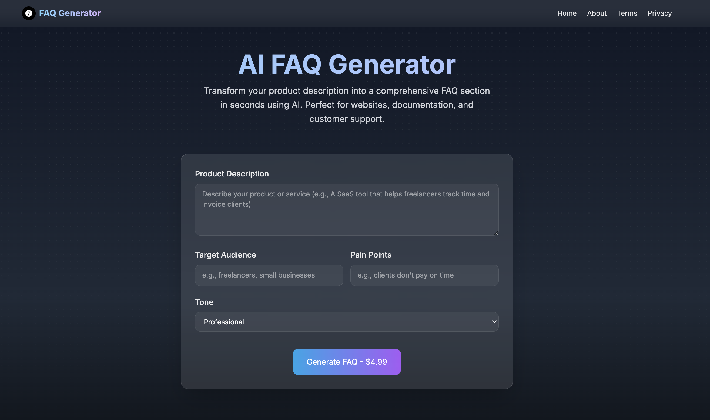

# AI FAQ Generator

A modern web application that uses AI to automatically generate comprehensive FAQ sections for products and services. Built with Next.js 14, TypeScript, and OpenAI's GPT-4.



## Features

- 🤖 AI-powered FAQ generation using GPT-4
- 🎨 Beautiful, responsive UI with Tailwind CSS
- ✨ Real-time preview with markdown support
- 💰 Pay-per-use with Stripe integration
- 🔍 SEO-friendly output format
- 📋 One-click copy to clipboard
- 🌙 Dark mode by default
- 🎯 Customizable tone and style
- 📱 Mobile-responsive design

## Tech Stack

- [Next.js 14](https://nextjs.org/) - React framework with App Router
- [TypeScript](https://www.typescriptlang.org/) - Type safety
- [Tailwind CSS](https://tailwindcss.com/) - Styling
- [OpenAI GPT-4](https://openai.com/) - AI model
- [Stripe](https://stripe.com/) - Payment processing
- [React Markdown](https://github.com/remarkjs/react-markdown) - Markdown rendering

## Prerequisites

Before you begin, ensure you have:

- Node.js 18.17 or later
- npm or yarn
- An OpenAI API key
- A Stripe account (for payment processing)

## Getting Started

1. Clone the repository:

   ```bash
   git clone https://github.com/tbenjis/ai-faq-generator.git
   cd ai-faq-generator
   ```

2. Install dependencies:

   ```bash
   npm install
   ```

3. Create a `.env.local` file in the root directory:

   ```env
   # OpenAI API Key
   OPENAI_API_KEY=your_openai_api_key_here

   # Stripe API Keys
   STRIPE_SECRET_KEY=your_stripe_secret_key_here
   NEXT_PUBLIC_STRIPE_PUBLISHABLE_KEY=your_stripe_publishable_key_here
   ```

4. Run the development server:

   ```bash
   npm run dev
   ```

5. Open [http://localhost:3000](http://localhost:3000) in your browser.

## Testing

Run the test suite:

```bash
# Run all tests
npm test

# Run tests in watch mode
npm run test:watch

# Run tests with coverage
npm run test:coverage
```

## Project Structure

```
ai-faq-generator/
├── __tests__/           # Test files
├── public/             # Static files
├── src/
│   ├── app/           # Next.js app router pages
│   ├── components/    # React components
│   ├── lib/          # Utility functions and hooks
│   └── styles/       # Global styles
├── .env.example      # Example environment variables
├── .gitignore       # Git ignore rules
├── jest.config.js   # Jest configuration
├── next.config.js   # Next.js configuration
├── package.json     # Project dependencies
├── tailwind.config.js # Tailwind CSS configuration
└── tsconfig.json    # TypeScript configuration
```

## API Routes

### POST /api/generate

Generates FAQ content using OpenAI's GPT-4.

Request body:

```json
{
  "description": "Product description",
  "audience": "Target audience",
  "painPoints": "Pain points to address",
  "tone": "professional|casual|friendly|technical"
}
```

### POST /api/create-checkout-session

Creates a Stripe checkout session for payment.

## Environment Variables

| Variable                           | Description                 | Required |
| ---------------------------------- | --------------------------- | -------- |
| OPENAI_API_KEY                     | Your OpenAI API key         | Yes      |
| STRIPE_SECRET_KEY                  | Your Stripe secret key      | Yes      |
| NEXT_PUBLIC_STRIPE_PUBLISHABLE_KEY | Your Stripe publishable key | Yes      |

## Contributing

Contributions are welcome! Please read our [Contributing Guide](CONTRIBUTING.md) for details on our code of conduct and the process for submitting pull requests.

1. Fork the repository
2. Create your feature branch (`git checkout -b feature/AmazingFeature`)
3. Commit your changes (`git commit -m 'Add some AmazingFeature'`)
4. Push to the branch (`git push origin feature/AmazingFeature`)
5. Open a Pull Request

## License

This project is licensed under the MIT License - see the [LICENSE](LICENSE) file for details.

## Support

- Create an issue for bug reports or feature requests
- Star the repository if you find it useful
- Follow [@tbenjis](https://twitter.com/tbenjis) on Twitter for updates

## Acknowledgments

- OpenAI for their amazing GPT models
- The Next.js team for the fantastic framework
- All contributors who help improve this project

## Roadmap

- [ ] Add support for multiple languages
- [ ] Implement user authentication
- [ ] Add more customization options
- [ ] Create API documentation
- [ ] Add export options (PDF, Word, etc.)
- [ ] Implement batch processing
